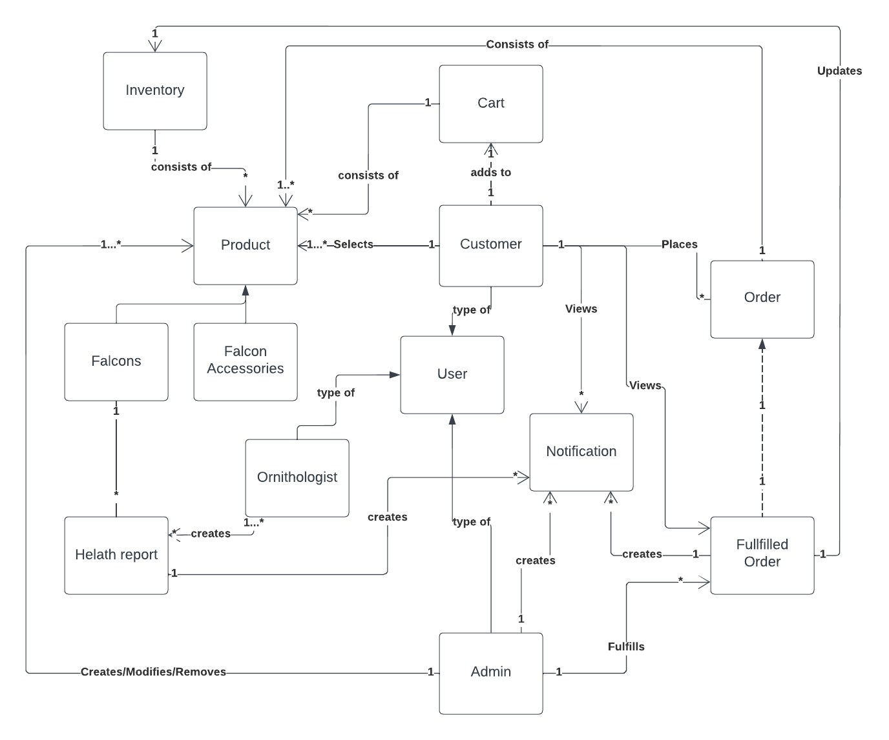
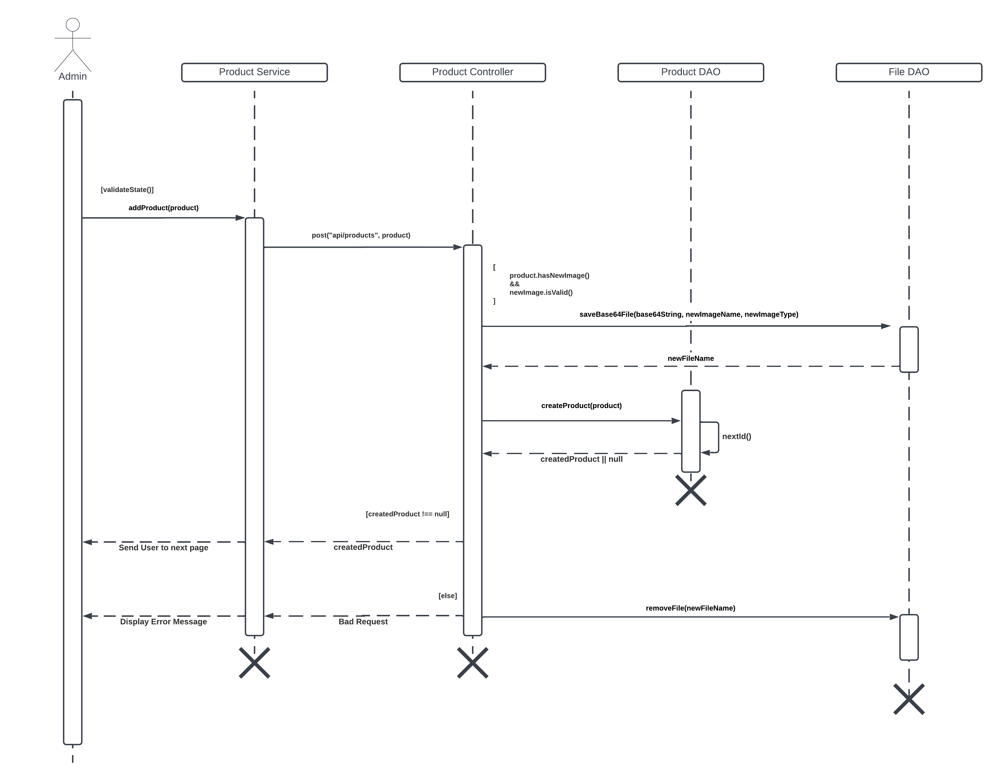
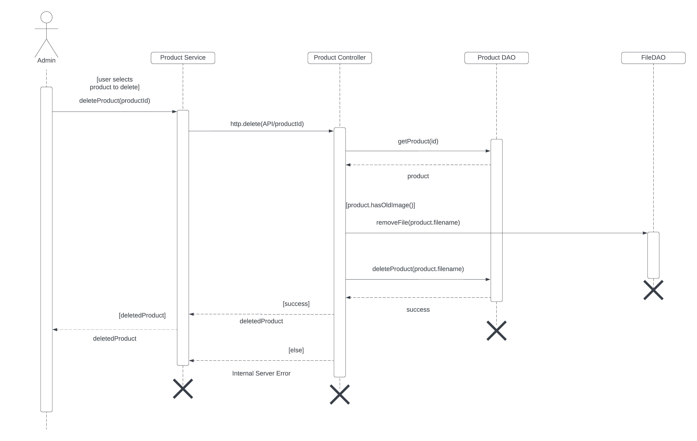
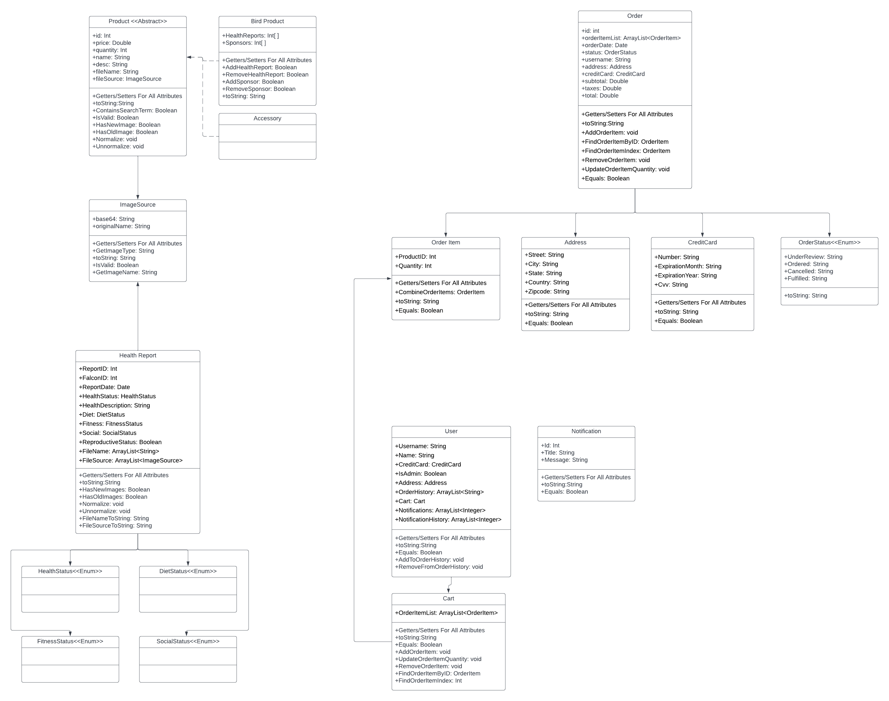
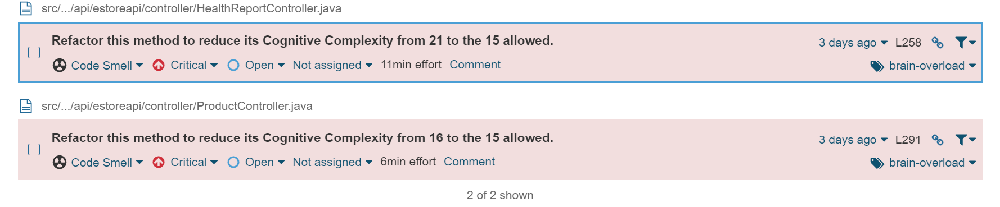
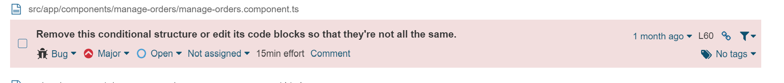
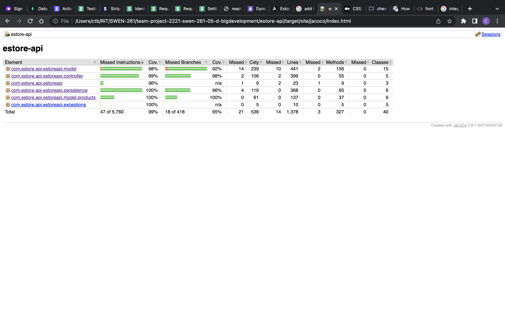

# PROJECT Design Documentation

## Team Information

- Team name: Big-Development
- Team members
  - Ryan Current
  - Chris Hamm
  - Michael Ververs
  - Andrew Leon
  - Colin Tondreau

## Executive Summary

This website will allow users to buy health tracking status for falcons. It will also allow users to donate.
This website is an e-store that allows users to sponsor falcons. This includes making a donation towards a falcon to pay for its care, as well as buying accessories for falcons, such as snacks or toys. The website will also allow users to view a falcon's health reports, which are created and shared by an ornithologist.

### Purpose

Admins will be able to manage products, users, inventory, and notifications. Customers will be able to browse and search for birds and accessories, sponsor birds, view health reports, and recieve notifications. Ornithologists will create health reports. Together, this store will function to connect owners and falcon enthusiasts.

### Glossary and Acronyms

| Term  | Definition                        |
| ----- | --------------------------------- |
| SPA   | Single Page                       |
| API   | Application Programming Interface |
| UI    | User Interface                    |
| Stack | Spring API + Angular UI           |
| DAO   | Data Access Object                |
| UML   | Unified Modeling Language         |
| CRUD  | Create, Read, Update, and Delete  |

## Requirements

Admins are able to manage all inventory, orders, products, users, notifications, and health reports.

Customers are able to manage their profile, find and sponsor/purchase falcons and accessories, and view health reports for their sponsored birds.

Ornithologists can create health reports.

All user types are able to see notifications.

### Definition of MVP

- Users are able to sign in to their profile using their username.
- Admins are able to manage all inventory, orders, products, and users. This includes creating, updating, and deleting these objects.
- Customers are able browse and purchase products, add them to a cart, and create orders. Customers are also able to manage their profile, which includes changing their personal information and viewing the orders that they have made.
- A customer's cart should save upon logout or closing the page, and remain the same when the customer logs back into the page.

### MVP Features

All users:

- sign in capability
- view all inventory capability
- search all inventory capability

Admin:

- CRUD operations for products
- Read and update operations for orders
- CRUD operations for inventory
- CRUD operations for users

Customers:

- adding items to cart
- creating an order and checking out
- cancelling an order

### Roadmap of Enhancements

Done:

- Health reports are summaries of a certain falcon's wellbeing, activity, and other information, including pictures. These are created and posted by an in-house ornithologist, and can be viewed by customers who sponsor that falcon, as well as admins.
- Notications appear as a pop-up on the screen. An admin can create a new notification, give it a title and a message, and select users who will receive the notification. Notifications are automatically sent to a customer when a new health report is made available for a falcon that they sponsor, as well as when a different customer sponsors a falcon that they also sponsor.

To be implemented:

- A chat system would allow customers to communicate with each other on the website, as well as communicating with the store's admins with any questions or comments.
- Diagrams/charts/etc. displaying purchasing trends would be a useful tool for owners and admins of the store, informing them of the most and least popular falcons and products, customer activity, and other information that would help improve the website and inventory.

## Application Domain

This section describes the application domain. The domain model of the website is found below.

The main entities are Users, Products, and Orders. Users have different access levels to Products and Orders. Overall, Users will create, read, update, and delete Products, Orders, and themselves to make this estore work.

## Architecture and Design

This section describes the application architecture.

### Summary

The following Tiers/Layers model shows a high-level view of the webapp's architecture.

The e-store web application is built using the Model–View–ViewModel (MVVM) architecture pattern.

The Model stores the application data objects, including any functionality, to make the store and its information persistent.

The View is the client-side SPA built with Angular utilizing HTML, CSS and TypeScript.

The ViewModel provides RESTful APIs to the client (View) as well as any logic required to manipulate the data objects from the Model.

Both the ViewModel and Model are built using Java and Spring Framework. Details of the components within these tiers are supplied below.

### Overview of User Interface

Our UI is split into 5 main pages:

- A store page where users can browse and search for products.
- A sign in page for users to sign in and manage their information.
- A cart page (only available to customers) where customers can create orders.
- A product view page where product details and health reports can be viewed
- An administrator/ornithology console, where admins/ornithologists can manage inventory, products, users, and orders.

### View Tier

The view tier of Falkoner consists of the 5 pages above, as well as additional pages that handle other operations or information. The user opens the site to the landing page, which is a non-main page that describes the store. From there, the user can navigate to the home page by clicking a button. The home page allows the user to see all available products in the inventory and navigate to see a singular product on the product's detail page. This page shows the user information about the product, such as the price, description, and images associated with the product. If the user is logged in, they can add the product that they are viewing to their cart; if they are not, then the user is directed to login before adding said product to their cart. On the login page they are able to login, create an account, update their account's information, and see all previous orders that they have made. Once logged in, the user is able to visit the cart page, where they can view all the products they have added to their cart, change the quantity of the products, and proceed to checkout if their information is present and updated.

The last main page, the admin dashboard, is only accessible to an administrative user. From here the admin is able to perform CRUD operations on all users, orders, notificatons and products, all from the same page. A different version of this page, the ornithologist dashboard, is only accessible to users with ornithologist privileges. This page allows ornithologists to add and update health reports for the available falcons.

The following sequence diagam details the process of creating a new product. In the UI, an admin creates a new product and provides the required information (name, price, description, etc.). The product service takes this information and sends it to the product controller, which firsts validates the information. The image file provided is saved into the file DAO, and the product DAO creates and saves a new product. If everything went smoothly, the new product is returned and reflected in the UI; if there was an error at any point, an error message is displayed.

The next sequence diagram details the process of fulfilling an order.

### ViewModel Tier

The ViewModel tier handles Aplication Program Interface (API) requests made to our Spring Framework Server. This tier contains the controller, which encompasses the business logic that may validate and or manipulate any data before updating our model (Model) tier. This tier also contains the Services that provides mapping to our client (View) to handle get, post, update, and delete requests which are made to the controller. Our estore offers the following controllers for their respective models:

- ProductController
- OrderController
- UserController
- HealthReportController
- NotificationController

Within our Estore UI, we also offer the following services:

- Product Service
- Order Service
- Cart Service
- User Service
- HealthReport Service
- Notification Service

Controllers and Service all handle the following operations:

- Create (Post)
- Read (Get)
- Update (Put)
- Delete (Delete)

### Model Tier

The Model is responsible for saving and handling the data after the service requests it. An example is the User model: When a user logs in/creates an account, data must be filled in by the user. This data is then checked and set, which ensures the usability of the data. The Product model likewise sets the data types of a product’s attributes; however, this model has more responsibilities and functionality when it comes to CRUD operations, considering the fact the Product model is an abstract class used to create different types of Product, but with the same attributes.

### Static Code Analysis/Design Improvements

Something we noticed on the static code analysis was a missing function in the API, a hashcode function in our model tier. When a model overrides the equals functionality, we should also be overriding the hashcode functionality.

Another factor that we noticed upon static code analysis was within our controller tier, we would check for every specific error thrown and in some cases return the same result and status. The scanner is telling us to instead either generalize the response given for all errors or very similar errors.

Something we noticed through SonarSanner when analysing our UI we noticed that the scanner told us that some of our logical structure just led to the same result, meaning that it was unneccassry

## Testing

This section will provide information about the testing performed and the results of the testing.

We worked on testing our API service as fully as possible, only missing a few minimal branches throughout the entire codebase. Testing through JUnit, we brought our covered instructions up to 99% and our covered branches up to 95%.

### Acceptance Testing

There are no remaining user stories that have failed acceptance criteria tests. All user stories pass their acceptance criteria, and all aspects of the store work as intended.

### Unit Testing and Code Coverage

Our unit testing goal was to reach at least 95% coverage and to have all tests pass. If a particular test did not pass, we went back to our code and ensured that test did pass. We targeted all models and controllers of the API to ensure that we had a solid backend.

